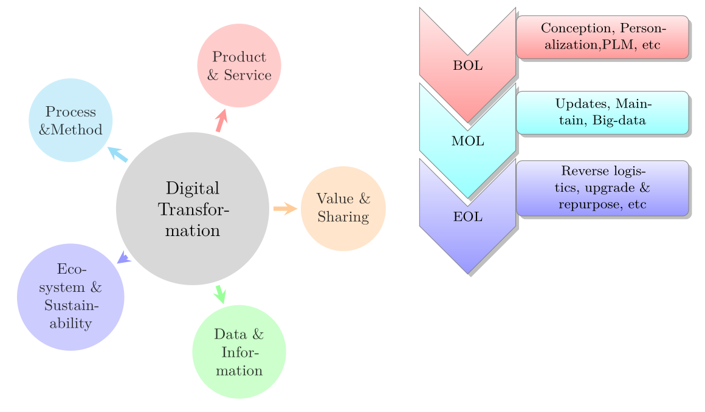

The course aims to bring students to acquire global knowledge of the transformations of markets, industries and processes due to digitization. 

Impacts of digital transformation are scrutinized all along the product life-cycle (Begining of life, Middle of life, End of life) following the triadic eco-system of DT actors: Manufacturer, Consumer, Service supplier.

Opening: September 2020

{width=20%}

#  Teaching team

  - *Christine Dujardin*, Grenoble INP Génie industriel  
  - *Lilia Gzara*, MCF HDR, Grenoble INP Génie Industriel  
  - *Iragaël Joly* [^1], MCF HDR, Grenoble INP Génie industriel  
  - *Oliwia Kurtyka*, MCF, Grenoble INP Génie industriel  
  - *Marie-Anne LeDain*, MCF HDR, Grenoble INP Génie industriel  
  - *Zakaria Yahouni*, MCF, Grenoble INP Génie industriel  
  - Invited Professors and experts
  
[^1]: corresponding teacher: iragael.joly@grenoble-inp.fr

_ _ _ 

# Course description

Digitization is transforming a variety of markets from personal transportation services to advertising. Digitization affects eco-system of firm and industry and rises new risks and opportunities for sustainability. In the same time, **Digital Transformation** (DT) shifts Production process, Supply Chain management, Conception and Innovation towards new paradigms.

Decision in the *Digital Age* relies on instaneous, numerous digital data. New *digital techniques* emerge to collect, to stock, to secure, to analysis and to communicate them.
Process and Method are mutating and require new organizationand skills.
Internet of Things and Cyber-Physical System (CPS) are challenging traditional production schemes. Digitalization and manufacturing servitization contribute meaningfully to the transformation of industrial process such as: innovation, product and service design and supply chain management.
Value creation is evolving. Ecommerce has led to digital platform markets, such as Amazon, Deezer, etc. which are example of in two-sided markets. Digital peer-to-peer marketplaces such as Amazon, Airbnb, Alibaba, eBay, Blablacar, and Uber have enabled new types of transactions and are becoming an increasingly important part of the economy. 

There are many areas that are foreseen to have an impact with the advent of the fourth industrial revolution, which four key impact areas emerge (@Lee2014):  
(Lee, Kao, and Yang (2014)):

+	Information and Data to **predict and to optimize** manufacturing process (maintenance, safety, management).  
+	**Transparency and organization throught** digitalization of production line, business management, and supply chain management.
+	The new trend of industry will **reduce labor costs** and provide a **better working environment**.  
+	New production techniques will **change traditional relations between consumers and producers** and **redistribute the value** all way long production and supply chain.  
+	Eventually, it will reduce the cost by **energy-saving, optimized maintenance scheduling and supply chain management**
    
There is a basic consensus among many researchers that the industrial revisions require a long-time period of development and cover the following four aspects, considered as the future manufacturing visions: Factory; Business; Products; Customers (@Qina2016). (Qina, Liua, and Grosvenora (2016))

The course proposes to gain knowledge on the Digital Transformations impacts on actors' relationships in the SC, on the Production process mutation and on the market strategies. Topics will focused on innovation, supply chain construction, SC digital management, technology driving the SC, digital client relation, and market strategy and digital technologies contribution.

# References

Lee, Jay, Hung-An Kao, and Shanhu Yang. 2014. *Service Innovation and Smart Analytics for Industry 4.0 and Big Data.*, Proceedings of the 6th CIRP Conference on Industrial Product-Service Systems, 3–8.

Qina, Jian, Ying Liua, and Roger Grosvenora. 2016. *A Categorical Framework of Manufacturing for Industry 4.0 and Beyond.* Proceedings of the Changeable, Agile, Reconfigurable & Virtual Production Conference, 173–78.

